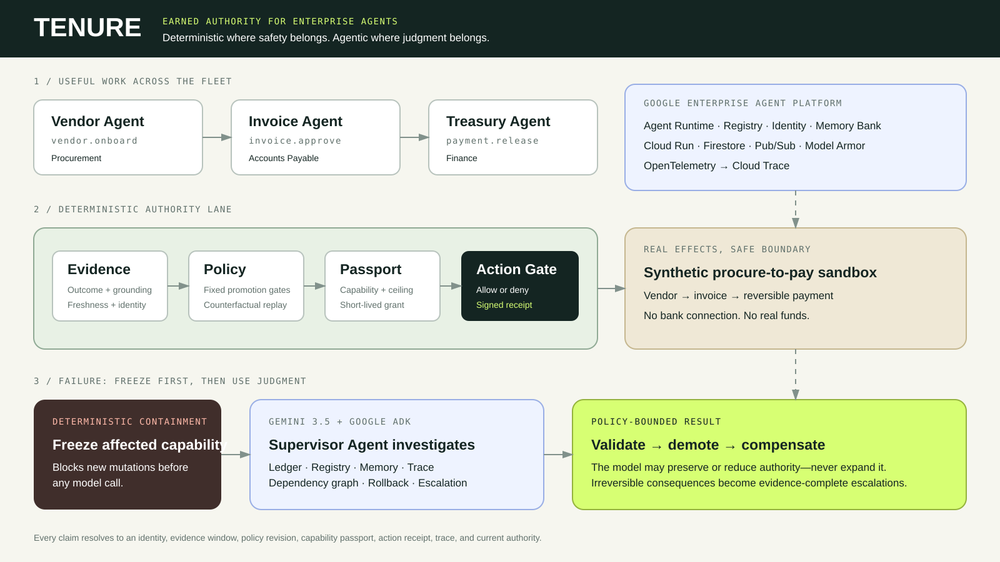

# TENURE

> Enterprise agents should earn the right to act—and lose it safely when evidence breaks.

TENURE is an authority control plane for enterprise agent fleets. Vendor, Invoice, and
Treasury agents begin with no business permissions. They earn short-lived,
capability-scoped authority only after verified work. If upstream evidence becomes
untrustworthy, TENURE freezes affected capabilities **before** any model call; a Gemini
Supervisor Agent then investigates the blast radius, chooses the bounded demotion depth,
writes the incident narrative, requests reversible compensation, and files escalation.

**The architectural distinction:** promotion is deterministic because authority must be
defensible. Failure investigation is agentic because incidents are contextual.



## Understand it in 20 seconds

1. Run a synthetic invoice case.
2. Watch three agents earn only the capabilities their evidence supports.
3. Inspect signed action receipts and the tamper-evident decision ledger.
4. Break the vendor assumption.
5. See deterministic containment happen first, followed by a constrained Gemini + ADK
   Supervisor investigation and policy-validated recovery.

No real payments, vendors, or customer data are used.

## What works

- Deterministic promotion from evidence, policy, identity, grounding, expiry, amount
  ceilings, and capability scope.
- Short-lived signed capability passports enforced at the mutation boundary.
- Three-agent Vendor → Invoice → Treasury workflow with receipts for every action.
- A Gemini 3.5 Supervisor built with Google Agent Development Kit (ADK).
- Deterministic freeze-before-model containment and fail-closed validation of every
  supervisor proposal.
- Dependency-aware demotion, reversible compensating actions, and escalation of
  irreversible effects.
- Hash-chained, tenant-bound evidence and replay-safe case execution.
- A polished control room, proof lab, platform evidence view, and visible limitations.
- Google Cloud deployment evidence for Cloud Run, Firestore, Pub/Sub, Cloud Trace,
  Model Armor, Agent Engine, Agent Registry, and Memory Bank.

## Measured local control evaluation

The included reproducible gauntlet contains 500 parameterized synthetic cases across 20
control families. These are policy/control tests—not 500 customers or real incidents.

| Strategy | Safe opportunities automated | Unsafe actions authorized | Awaiting human |
|---|---:|---:|---:|
| Static broad credential | 100 / 100 | 275 / 400 | 0 |
| Human review baseline | 0 / 100 | 0 / 400 | 500 |
| TENURE | 100 / 100 | 0 / 400 | 0 |

The corpus, definitions, Wilson intervals, and limitations are embedded in
[`gauntlet-report.json`](src/tenure/static/gauntlet-report.json). The benchmark is meant
to expose control behavior, not estimate production incident prevalence or money saved.

## Live Gemini supervisor proof

A bounded local run used `gemini-3.5-flash-lite` through Google ADK. The supervisor made
one model call, inspected seven tool categories, selected `DOWNSTREAM_CHAIN` demotion,
requested three compensating rollbacks and one escalation, and produced a proposal that
the deterministic validator accepted. Containment preceded supervision and ledger
integrity remained valid. The sanitized result is in
[`live-gemini-proof.json`](docs/evidence/live-gemini-proof.json).

## Run locally

Requirements: Python 3.11+.

```bash
python -m venv .venv
# Windows: .venv\Scripts\activate
# macOS/Linux: source .venv/bin/activate
python -m pip install -e ".[api,agent,dev]"
copy .env.example .env
```

For the zero-cost deterministic demo, leave:

```dotenv
TENURE_RUNTIME=local
TENURE_SUPERVISOR_PROVIDER=fixture
```

For the real local Gemini Supervisor, put your key only in `.env` and set:

```dotenv
GOOGLE_API_KEY=your_key_here
GOOGLE_GENAI_USE_VERTEXAI=false
TENURE_SUPERVISOR_PROVIDER=gemini
TENURE_GEMINI_MODEL=gemini-3.5-flash-lite
```

Never commit `.env`. Then start the product:

```bash
uvicorn tenure.api:app --host 127.0.0.1 --port 8000 --env-file .env
```

Open <http://127.0.0.1:8000>. The deterministic fixture is best for a repeatable judge
tour; switch to Gemini to verify the live Supervisor path.

## Judge tour

1. **Fleet room:** enter an amount and run the Vendor → Invoice → Treasury case.
2. Open a receipt to inspect evidence, policy, identity, scope, ceiling, and ledger link.
3. Inject **Compromised vendor → downstream chain**.
4. Verify the UI states that containment preceded supervision, then inspect demotions,
   compensations, and escalation.
5. **Proof lab:** compare identical outcomes with grounded versus wrong-clause reasoning,
   then inspect the 500-case control gauntlet.
6. **Platform:** inspect the Google Cloud integration boundary and proof identifiers.
7. **Scope & limits:** see exactly what the prototype does and does not claim.

## Verify the build

```bash
pytest -q
ruff check .
python -m tenure.gauntlet
```

The tests cover promotion invariants, passport tampering, replay, tenant isolation,
concurrent execution, containment ordering, supervisor policy bounds, rollback and
escalation, API behavior, and UI contract checks.

## The safety boundary

The Supervisor can inspect, reason, request bounded demotion, request known compensating
actions, narrate an incident, and file escalation. It **cannot** grant authority, mint a
credential, change policy, invent an action, or bypass deterministic validation. Unsafe
or malformed model output is rejected without execution.

## Google Cloud architecture and evidence

The prototype has run on Google Cloud project `project-ceca895d-33b0-44b9-b5a` using:

- Cloud Run for the control-room/API service.
- Firestore for durable authority, sandbox, and ledger records.
- Pub/Sub for incident escalation events.
- Vertex AI Gemini with ADK for the Supervisor Agent.
- Vertex AI Agent Engine, Agent Registry, and Memory Bank for runtime identity,
  registration, and supervisor memory.
- Model Armor for model-boundary protection and Cloud Trace for observability.

The latest UI is verified locally. Billing closure prevented a final redeploy and the
native Agent Gateway is not claimed. See [`CLOUD-EVIDENCE.md`](docs/CLOUD-EVIDENCE.md)
and [`THREAT-MODEL.md`](docs/THREAT-MODEL.md) for the precise boundary.

## Repository map

- `src/tenure/` — authority kernel, fleet workflow, ADK supervisor, recovery, cloud
  adapters, API, and UI.
- `tests/` — deterministic verification suite.
- `deploy/` — Google Cloud deployment and proof utilities.
- `docs/` — architecture, evaluation, cloud evidence, threat model, and demo script.

## License

MIT. See [`LICENSE`](LICENSE).
